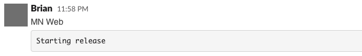
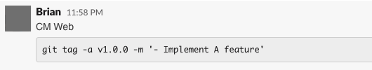

# Mikeneder web

## Tech Stack

There is a list of packages that you should be at least familiar with before starting the project. However, the best way to see a complete list of the dependencies is to check out package.json file.

#### Major stuff

- [x] [Next.js](https://nextjs.org/)
- [x] [Apollo Client](https://www.apollographql.com/docs/react/)

#### Form library

- [x] [Formik](https://github.com/formik/formik)

#### Create custom components

- [x] [styled-components](https://github.com/styled-components/styled-components)
- [x] [Styled System](https://github.com/styled-system/styled-system)
- [x] [Storybook](https://github.com/storybookjs/storybook)'

#### Test

- [x] [Jest](https://github.com/facebook/jest)
- [x] [ts-jest](https://github.com/kulshekhar/ts-jest)
- [x] [React Testing Library](https://github.com/testing-library/react-testing-library)

#### Linter & Formatter

- [x] [ESLint](https://github.com/eslint/eslint)
- [x] [Prettier](https://github.com/prettier/prettier)
- [x] [EditorConfig](https://editorconfig.org/)

#### Pre-commit checks

- [x] [Lint-staged](https://github.com/okonet/lint-staged)
- [x] [Husky](https://github.com/typicode/husky)

## Set up

### Prerequisites

- [Install Yarn](https://yarnpkg.com/lang/en/docs/install/)

### Install

```
$ git clone git@github.com:CodeMonkey-Mike/mikeneder-web.git
$ cd mikeneder-web
$ yarn
```

### Run

By run the command below, the site will start at `localhost:3000`. This will auto-reload when there is any change in the source code.

```
$ yarn dev
```

### Connect to Graphql API

By default, the client-side connects to Staging API even local or QA site. We can use `.env` file to configure the default values.

- To test specific API pull request go directly to the file `src/env.js` and update `NEXT_PUBLIC_API_PR` by fill the PR number into double quotes `''`, remove it before merging into the master branch.

```
module.exports = {
  env: {
    NEXT_PUBLIC_API_URL: env.NEXT_PUBLIC_API_URL || 'https://api-staging',
    //Please make sure next variable is empty before merging into master
    NEXT_PUBLIC_API_PR: env.NEXT_PUBLIC_API_PR || '', // E.g => '10'
    ...
  },
};
```

- To test Graphql API local, change `'https://api-staging'` into `'http://localhost:4000'`. Change it back when testing is done.

### Release Instruction

##### 1. When creating a new PR, the new build will execute for that PR, then create a new domain for it.

```
https://qa{PR_NUMBER}.mikeneder.me
```

##### 2. Merge your PRs into `master`

- After code reviewed, use `merge` at the bottom of pull request page. The pipeline will run after all checks passed the site will update.

```
https://staging.mikeneder.me
```

##### 3. Confirm your changes on `staging.mikeneder.me`

##### 4. Post starting release in `#web-release` channel



##### 5. Checkout master, pull latest and run

```
$ yarn release -auto
```

This action will run release script automatically which is pull a latest commit and collecting the message then increase previous version to new version.

or we can do it manually

<b>a. Single ticket</b>

```
$ yarn release '- Implement A feature'
```

<b>b. Multiple tickets</b>

```
$ yarn release '
> - Implement A feature'
> - Fix B issue'
> '
```

##### 6. Edit your `Starting release` message in the channel by paste the message that automatically copied to your clipboard after run the command release above.



##### 7. Verify on production

```
https://wwww.mikeneder.me
```
